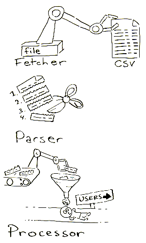

=====================
Basics of integration
=====================

S4 uses Drupal's `Feeds module <http://drupal.org/project/feeds>`_ to integrate with external systems. This gives your campus enormous flexibility when picking integration methods (REST, batch files, direct database connections) and a thoroughly logged and customizable method to bring in both student data as well as course information and migrating site and site staff data from other databases.

As an administrator, you can setup feeds by going to ``http://mysite.edu/admin/structure/feeds``, or clicking on *Site Settings* and selecting *Setup Feed Importers* under the *SIS Integration* section. S4 requires multiple importers, each of which are responsible to import and update different things like courses, users, or even sites for the purposes of migration. To get started, the demonstration module (:ref:`demo-module`) comes with feed importers you can take a look at and compare to the files included with the module.

Feed importer glossary
----------------------

Feed importers consist of four different sections: Basic Settings, Fetchers, Parsers, and Processors. This allows you to combine different methods of fetching data (download a file, process an upload, make an HTTP reqest), breaking the data format up (parsing a CSV or XML file), and finally matching the data up with S4's internal collection of things like courses and students. From the Feeds Importers page, you can either start by creating a new importer, or copy a demo importer.

For Fetchers, Parsers, and Processors, you have two options: one is to *Change* the method of fetching, etc.; while another is to fiddle with the *Settings* of the chosen item.

All of these pieces fit together to build a modular "factory" that can, for example, retrieve a CSV file and create users:

Basic Settings
^^^^^^^^^^^^^^

Regardless of how you get information or parse it, every feed parser needs general settings that describe the importer and how it functions. For S4's purposes, the *Basic Settings* section of a feed importer should go something like this:

1. *Name* - The name of the importer, just used for admin.
2. *Description* - More information for administrators about this importer.
3. *Attach to content type* - Should always be "Use standalone form." The feeds module can also be used for things like user-generated aggregation, which is useful for something like a social networking site, but doesn't really apply to S4.
4. *Periodic import* - How often should the feed data be updated? You can turn off the importer alltogether by changing this value to "Off"
5. *Import on submission* - After you create your feed importer, you then submit information about where to get the data on another page. When this option is on, the importer will run immediately after you submit the import location. This should be left on usually.
6. *Process in background* - If Import on Submission is on, you can tell Feeds to process on the screen and give you a progress bar with how many records it has imported, but when this option is on, the import is put into a queue to be processed in the background.

Fetcher
^^^^^^^

Fetchers describe how the data is to be retrieved. When you click *Change* under *Fetcher* you will see either a File upload or HTTP fetcher. There are other modules (outlined below) that can fetch by connecting to a database or some other method.

Settings
""""""""
Normally, the File fetcher only allows users to upload a file with the data, which is fine for testing. However, you might want to check the *Supply path to file or directory directly* option to allow the fetcher to instead grab the file locally if you are using batch files that are FTPd to your server.

Both settings for the HTTP fetcher (Auto-detect feeds and PubSubHubub support) are more oriented to content aggregation and doesn't make sense to use for S4.

Parser
^^^^^^
There are four different kinds of Parsers, but other ones like parsing database records by connecting to an external database can also be added, see :ref:`extending-feeds`.
1. *Common Syndication* - Useful for parsing RSS and ATOM feeds, which might be used if your SIS exposes data in those formats.
2. *CSV Parser* - Can process any kind of delimited file, not just comma-delimited
3. *OPML Parser* - `OPML <http://en.wikipedia.org/wiki/OPML>`_ is a standard way to build flexible XML files that fit your data schema.
4. *Sitemap Parser* - Not used for S4. 

Processor
^^^^^^^^^

Processors actually handle how your now fetched and parsed data matches to data within S4. S4 has two custom processors to build relationships between faculty/students and courses, but the others come with the Feeds module. With the exception of students and faculty, everything else in S4 (courses, sites, terms) are imported as "nodes".

Processors also handle *mapping*, which is how S4 tells what part of parsed data goes where. For example, our CSV file might have a column called "first_name" (the source) which we can then map to the "First Name" (the target) field for students.

An important thing to keep in mind when handling processors is to think about your Globally Unique Identifier (GUID). S4 uses the GUID to determine if a record being imported has  already been imported and should be updated, or to connect some previously imported information like a course and student and then link them together. We'll go over each type of importer and outline it's uses. Under the *mapping* section of each processor, you can add a field multiple times, so you can, for example map a student's ID to both a Student ID field as well as the GUID field. When adding a GUID field, also make sure to check the *Unique Target* checkbox. 

Importing Terms (semesters, quarters)
"""""""""""""""""""""""""""""""""""""
Use a *Node processor* and under *Settings* select *Course Term* as the content type, and set *Expire Nodes* to "Never." Under the *Update existing nodes* section choose "Update existing nodes."

Under *Mapping* set the Title (the human friendly version of the term like "Fall 2012"), term code, and start/end dates. It's reccomended to use your SIS's internal code for the term (in CMS/PeopleSoft this is called the Term Code and is a four-digit number) GUID.

Importing Courses
"""""""""""""""""
Again, use the *Node processor* and under settings use the same options as we outlined under Importing Terms; however, choose the "Course" content type instead.

You should generate a unique ID for each course in your export of data. For example, you could concatenate together BIO 100 section 1 meeting in Fall 2012 to have an ID of "Fall2012BIO1001". IDs must be unique to each course, but can be alphanumeric. This field should be mapped to the GUID target, which we will then use to connect students and faculty with the course.

You should map the actual term code (whatever kind of code you used for the GUID of your terms in the previous importers) to the target "Term (Node reference by Feeds GUID) -- allow duplicate nodes" to make sure S4 knows what term goes with what course.

.. _user-import:

Importing Students and Faculty
""""""""""""""""""""""""""""""
S4 actually treats all students and faculty as simple "users," who then get access to register under a course or manage students depending on their relationship to a course, so they can be imported together.

Use the *User processor* and under settings keep the default settings. Users also need a GUID, which in many CMS/PeopleSoft campuses is called the "emplid". Make sure to map this field to both the SIS ID field as well as the GUID field so that we can report on and find these users later. Another special field users have is called "Available programs," where you can print out the programs the user has access to. Programs allow users to register with a site without being associated with a course. If the program is setup in S4 as "Teacher education," and you want all users in teacher ed to use S4 at any time without being registered with specific coures, print "Teacher education" in a field that gets imported and mapped to "Available programs". If you have multiple programs a student belongs to, seperate them with a unique character like a pipe ( | ) and use tampering to split these values before they're processed :ref:`feeds-tamper`.

Importing student enrollment
""""""""""""""""""""""""""""
Use the custom S4 *Course enrollment processor* and make sure to provide the following data:

1. *Course ID* - The GUID of a course (as you setup in the course importer)
2. *User ID* - The GUID of a student (as you setup in the user importer)
3. *Enrollment indicator* - A boolean value (1 or 0) that indicates if the user is enrolled or not (useful to tell S4 if a student was dropped)
4. *GUID* - A unique ID to identify this enrollment record. For example, this could be a concatenation of the course ID as well as the user ID.

Importing faculty assignments
""""""""""""""""""""""""""""" 
Use the custom S4 *Course faculty processor* and make sure to provide the following data:

1. *Course ID* - The GUID of a course (as you setup in the course importer)
2. *User ID* - The GUID of a faculty (as you setup in the user importer)
4. *GUID* - A unique ID to identify this assignment record. For example, this could be a concatenation of the course ID as well as the user ID.

.. _feeds-tamper:
===============
Tampering Feeds
===============
"Tampering" feeds allows you to alter the default way that data is handled between the steps of parsing and processing the data. The most common use of tampering is to split a field into multiple values, for example, you might want users to have access to two kinds of programs within S4.

To tamper a field, go to ``admin/structure/feeds`` and click on *Tamper* next to the feed you want to alter. You will then see a list of field mappings from your importer. If we wanted to split "Available Programs" for users, for example, we would click on the *Add plugin* link below the corresponding mapping (maybe it would read "program -> Available Programs"), and then under *Plugin to add* select "Explode". We would then enter the Separator (like Pipe |) and click *Add*. `Read more about the available tamper plugins <http://drupal.org/node/1246578>`_.

===========================
Starting the import process
===========================

Once you have a feed importer setup, it's not processing any data yet! To get started, to go ``http://mysite.edu/import`` or click on *Site settings* and under *SIS Integration* select "Run and monitor feed importers." You will see a list of your importers. Click on the one you want to setup, and fill out the form. If you are using a File fetcher, for example, it might ask you to upload a file or type in the path to where your batch file is being added.

From here you can also view how many items have been imported with this feeds importer, and view a log that details what happened every time an import was run and provides details on errors.

If you are playing around and find you screwed up an import, you can also delete all the items associated with that feed importer by clicking the *Delete items* tab. 

.. _extending-feeds:
===============
Extending Feeds
===============
The following modules should be downloaded and installed if you need them, as S4 does not come wiht all methods of pulling data from external systems:

`Feeds SQL <http://drupal.org/project/feeds_sql>`_
--------------------------------------------------
Allows feeds to pull data from external database queries. All your database connection information is stored in non-readable config files for maximum security. To add a database to your site, edit the ``settings.php`` file located in the ``sites/default`` directory. The configuration is standard PHP Data Object (PDO) drivers, so you should consult the options for the database you're connecting to. Depending on your server environment, you might need to install the PDO driver as an extra, especially for less standard PHP databases like Oracle or MS SQL. `Read more about PDO and connection options <http://php.net/manual/en/pdo.drivers.php>`_.

Note that this module adds both a fetcher and parser for databases, and they should generally be used together.

.. code-block:: php

  $databases['integration']['mysis'] = array(  //Databases are in nested arrays, but we only have one DB for integration
    'driver' => 'mysql',  //The PDO driver to use
    'database' => 'databasename',
    'username' => 'username',
    'password' => 'password',
    'host' => 'localhost',
    'prefix' => 'main_',
    'collation' => 'utf8_general_ci',
  );
  
`LDAP Query Fetcher & Parser <http://drupal.org/project/ldap>`_
----------------------------------------------------
If all your user information is already in LDAP, you can fetch LDAP entries for specific subsets of users based on LDAP queries and bring over their information into S4.

`Excel parser <http://drupal.org/project/feeds_excel>`_
-------------------------------------------------------
Useful if you have an excel file to test with, you can upload via a File fetcher an excel file of data and have it parsed in it's native format.