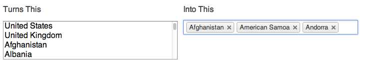

.. _chosen:

The multi-option widget in S4
=============================

There are lots of places in S4 where we have used a widget to allow choosing multiple options. Instead of a long list of checkboxes, or one of those confusing "control-click" windows, we have instead adopted a uniform way to handle selecing a long list of things like what organization type a site is.

To play around with this widget, check out the `example wepage of the project we used to build these widgets <http://harvesthq.github.com/chosen/>`_.

When selecing multiple options, here's a few tips:

1. You can always start typing to search the list for the option you want.
2. You can use the arrow keys to move up and down the list instead of using the mouse, if you prefer.
3. Once you select an item, you can remove it at any time by clicking the "x" next to it's name.