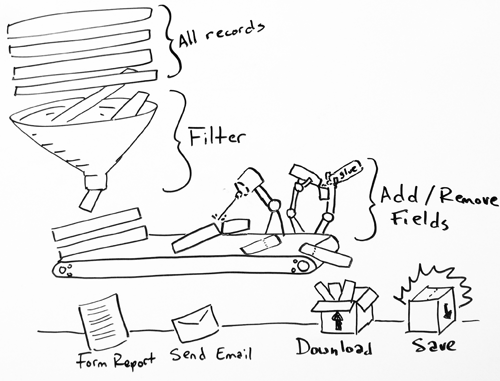
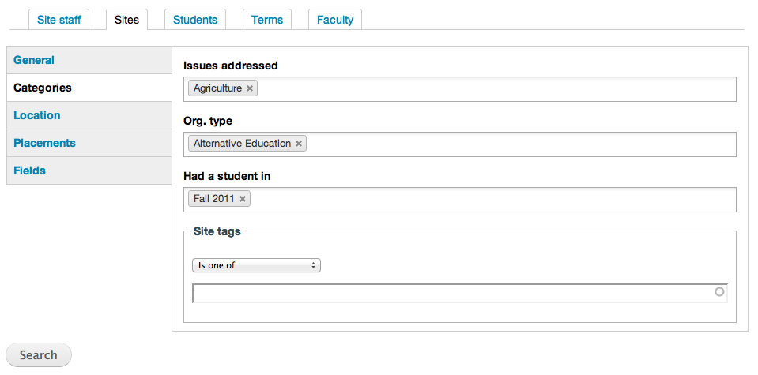
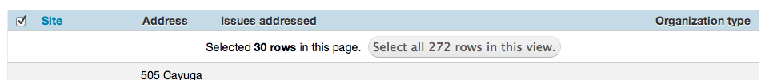

.. _reporting:
========================
Reporting & Bulk Actions
========================

You can generate reports about sites, site staff, faculty, students, or even the forms students or faculty fill out via the **Reports** tab in S4. Once you have a report, you can do one of two things:

1. **View the report** - You can add or remove fields you are interested and just browse a report online.
2. **Download the report** - Once you are happy with a report, you can download it as an Excel, Word, or CSV file.
3. **Perform bulk operations** - After completing a report, you can do things to the results, like send an email to all the students in a report, or compile a listing of all the form submissions by specific students.
4. **Save your report** - Reports can be saved for use later, and every time you view a report again it is automatically updated with any new information.

Simple reports
==============

There are five types of simple reports in S4, four of which are very similar in that selecting fields, searching, and performing operations are virtually identical:

1. **Sites** - Report on sites.
2. **Site staff** - Report on site staff, including information about students assigned to them.
3. **Students** - Report on students, including ones who are or are not assigned to a site.
4. **Faculty** - Report on people assigned as faculty to a course.

You can access any of these reports by clicking the **Reports** tab and selecting the appropriate tab below. There are typically three steps to run a report:

1. **Filter** - Use filters to remove records like students or sites you don't want in your report.
2. **Select fields** - Select the fields (like site name, organization type, student course, etc.) that you want in the report.
3. **Run** - Just click the "Search" button to see what you have found.

Filters
-------

All reports have filters which let you narrow down the number of items in your report. There are many types of filters, and they are broken into general categories. The filters for any report are the first thing you see on the page. 

To go through the filter categories, click the category on the left (in a site report, these are "General, Categories, Location, Placements"). Most filters are about matching the values of something to that filter. For example, under the Sites report, you can add the available programs you are interested in, or the three organization types you would like to search by. Most of these filters allow for more than one value (see :ref:`chosen`).

Some filters, like the "Site name" filter for the Sites report also allow you to select the way the filter will work. For example, when searching by Site name, you can filter by site names that start with, include, ends with, does not include, does not end with, etc. the word "school." 

Fields
------

Alongside the filters, you can also click on the **Fields** link to control what fields you want to add to or remove from your report. To add or remove a field from your report, just check or uncheck the field in the list. You can also use the arrows in the field table to reorder how your fields appear in the report.

Saving searches
---------------

Once you have the report you want, you can save your search for use later. After searching, you'll see a **Save this search as** field where you can give your search a name, then just click the **Save this search** button. 

Once you have a search saved, you can revisit it at any time by clicking the **Saved searches** button, which appears right below your filters (this button only appears after you have at least one search saved). When you click on it, you can then click the search you wish to re-run, or check the checkbox next to the name and the **Delete** button to remove it from your list.

Saved searches are always run against the most current information in your website, i.e. if you save a search for "Sites that start with the letter A" and then add a new site to S4, when you re-run your saved search, that new site will appear.

Sending emails
--------------

You can send mass emails to everyone or every organization which appears in your report, which is a quick way to send a blast email communication to thousands of people at a time. To send an email, first use your **Filters** to narrow down the list to the people or sites you wish to communicate to, then click the checkboxes next to each record you wish to email. Want to email everyone in your report? Just click the first checkbox in the header of the table, and you will see an option to select all the results.

Each type of report sends an email to different addresses:

* **Students** - Send an email to the address associated with the student's account (usually brought over from your student information system - see :ref:`integrationusers`);
* **Faculty** - Same as students, but with faculty.
* **Sites** - Send an email to the site's main email address (setup when you edit the site). 
* **Site staff** - Send an email to the individual site staff (setup when you create site staff).

After you have selected the records you would like to email, you can then write your email, click **Next**, confirm you are sending the message to that many people, and your emails will be sent one at a time to prevent being sent to spam.

Form reports
============

When a student completes a placement or evaluation form, or a faculty does an evaluation of student learning, that information can be downloaded or reported on using **Form Reports**. First, use a regular report to filter down your list of students or sites to just the records you are interested in looking at, then use the same method outlined in "Sending Emails" to select all the records. You can then click the **Run form report** button.

You will then be asked to provide the type of form you want to report on, and whether it was completed as an assessment, placement, or evaluation form, and then can limit the number of form results to look at for just placements in certain term(s) or a specific time period.

Once a form report is created, you will see a link to view the report. Because this information changes often, this report will only work for four hours; however, once you view the report, you can use the **Download** tab to download the results. You can also use the **Summary** tab to get a report on how the form was filled out, which is helpful when using things like grids or scales for users to complete.