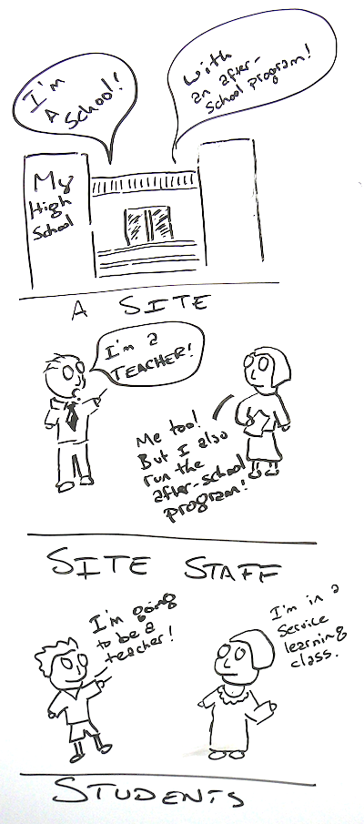

=====================
Things to think about
=====================

S4 was built to be extremely flexible, and with an eye to allowing multiple departments to exist within one website, which helps community partners (they don't get five different calls from departments about risk management forms), and helps ensure that partner information is accurate. In short, by having multiple departments all maintaining the same list of sites, students, programs, and signups, the more eyes the better.

You can, of course, give multiple departments their own S4 to use; however, that causes duplication of work from IT staff (they have to integrate two systems with the campus SIS, for example) and means that students might have an inconsistent experience when they are part of multiple programs. Below are a list of things to think about before you start your S4 journey. You might want to consult the :ref:`glossary` before reading this.

--------
Programs
--------

Programs in S4 are ways to divide up sites, courses, and students, and to let S4 know who's allowed to edit a site. Sites and site staff can be restricted to specific programs, and students are granted access to a program and it's associated sites and site staff by either being a part of a program directly (like a teacher ed program) or by being registered for a course associated with a program (like a Service Learning course):

For example, a high school (the site) may also have an after-school program. While a few teachers are available to mentor under for the teacher education department, there are also coordinators of the after-school program who can accept service learners. Some of these coordinators are also teachers and can mentor student teachers. If the site itself is setup to accept both service learners and teacher education students, each site staff can be restricted to just service learning, just teacher ed, or both (there are more options for site staff, see :ref:`site-staff`).

.. _program-options:
Program options
---------------

To administer the types of programs in your website, click on **Site Settings** and select **Programs** under **Categories**. From this page, you can view or edit existing programs, or click **Add term** to create a new program. When you edit a program, you have the following options:

1. **Name** - The name of your program
2. **Description** - Used when people are proposing a new course to your program, or when students are viewing your program, they will see this description. Try to keep it short, you can also link to the program website.
3. **Thank-you message** - The message users see after successfully sumitting a new site. This should probably also include information about who to contact with questions.
4. **Downloadable form instructions** - When a user views any forms they can download when they signup, for example a timesheet they cannot fill out online, these instructions will display above.
5. **Confirmation email** - When you enable confirmation emails using the "Send confirmation email when someone is signed up" checkbox, anytime a student signs up with a site, or a member of a department signs up the student on their behalf, the student will receive a customizable email. From this form, you can add the subject, email body, and reply-to email address (which should probably be the email address of your program). The email also supports tokens (read more about :ref:`tokens`). 
6. **Evaluation email** - The email which is sent out when a student needs to complete an evaluation form. It's important to include the token ``[s4_signup:evaluation_link]`` (found under the category *Student Signup Record*) in this email, as it will be replaced with the actual link to complete the evaluation. 
7. **Error message for students** - If a student or faculty logs into S4 and is neither part of a course that exists in S4, or is not assigned a program, they will instead see a message saying that they cannot access the website. After this message, each program on the website is shown with this error message. This is where you can explain what types of courses or students have access to your program, and who to contact with questions. 
6. **Maximum number of placements per student** - The number of placements at any given time a student can be in. Set to zero for no limit.